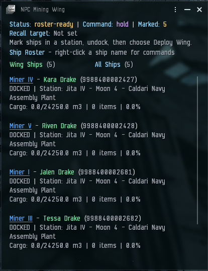

# NPC Mining Wing

[](LICENSE)
[](https://github.com/inerdy/NPC-Wing-Mining)
[](https://github.com/inerdy/NPC-Wing-Mining)
[](https://github.com/inerdy/NPC-Wing-Mining/commits/main)

NPC Mining Wing lets a player deploy up to six owned ships as a coordinated
NPC-controlled mining wing: five mining ships and one collection ship. Ships remain real owned hulls and use their fitted
modules, cargo holds, mining holds, drones, and the commanding pilot's skills.

## Features

- Mark ships in the station hangar and deploy them into the current system.
- Command the wing to follow, hold, mine, recall, or collect cargo.
- Use fitted mining modules and compatible mining or combat drones.
- Automatically return to unload when mining holds are full.
- Designate one marked ship as the collection ship so miners unload into it.
- Send the collection ship to its saved station to unload, then return it to the wing.
- Recall ships to their saved launch station, including across systems.
- Show ship location, cargo, mining, drone, and combat status in the in-game UI.
- Send status and command messages through the private Wing Comms channel.

The wing is limited to six NPC ships. The intended setup is five miners and one
collection ship. The player's active ship is not counted toward that limit.

## Requirements

- Native EveJS `0.12.9` — [EveJS Discord](https://discord.gg/WpYh9zpNrx)
- EVE client build `3396210`
- [EveJS Launcher `1.0.69`](https://github.com/V0nCleef/evejs-launcher/releases/tag/v1.0.69) or newer

This mod is native-only. Docker deployments are not supported.

## Installation

Copy or clone `npcMiningWing` into the EveJS `mods` directory. The manifest must
be located at:

```text
mods/npcMiningWing/evejs-launcher.mod.json
```

Enable the mod in the EveJS Launcher, apply the Game server restart, and open
the in-game **Mods** menu.

## Basic use

1. In a station, open **NPC Mining Wing** and mark owned ships.
2. Undock in the ship you want the wing to follow.
3. Deploy the marked ships.
4. Choose **Follow Wing**, **Hold Wing**, or **Mine Wing**.
5. Right-click one marked ship and choose **Set as Collection Ship**.
6. Use **Send Collection Ship to Station** when its hold needs to be unloaded.
7. Use **Recall Wing** to return all deployed ships to their saved launch station.

The collection ship does not mine. While the wing is mining, full mining ships
approach the collection ship and transfer their mining output to its appropriate
hold. The collection ship must be deployed and nearby for automatic transfers.
Its station trip uses the station where it was launched; the ship unloads mining
cargo into that station hangar before returning to the player's current system.

There is no separate configuration file. The mod stores its state under the
active EveJS data root at `gameStore/npcMiningWing/state.json`.

## In-game view



## Removal

Disable the mod in the Launcher and restart the Game server. Deployed ships
remain real inventory items. Do not delete the state file unless you intend to
reset the wing's saved metadata.

## License and maintenance

This project is released under the MIT License; see [LICENSE](LICENSE).

You may alter, maintain, and re-release the mod if it becomes unmaintained.
Please retain credit to the original author, **Troublesum**, in the source and
documentation.

## AI disclosure

Parts of this project were developed with assistance from AI tools. The code,
behavior, testing, documentation, and releases are reviewed and maintained by
Troublesum. AI assistance does not change the license or ownership of this
project.
